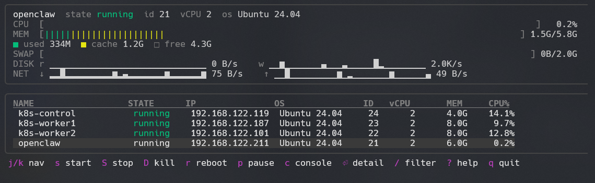

# dirt — David's libvirt TUI

A k9s-style terminal UI for managing libvirt / QEMU / KVM virtual machines, taking inspiration from htop.



`dirt` is a single-binary Go program built on [Bubble Tea](https://github.com/charmbracelet/bubbletea), [lipgloss](https://github.com/charmbracelet/lipgloss), and the [official libvirt-go bindings](https://gitlab.com/libvirt/libvirt-go-module). It connects to your local (or remote) libvirt daemon and gives you a live, vim-lite keyboard-driven view of every domain — with CPU and memory bars, disk and network sparklines, and full lifecycle control from a single keypress.

## Why it exists

I've always missed a good TUI for libvirt/kvm, so I vibecoded this together with Claude Code on my phone while having breakfast. Loads more features planned for handling network, storage, snapshots, etc.

## Features

- **Live VM table** — name, state, IP, OS, ID, vCPU, memory, CPU%
- **Sortable columns** — `1`–`5` to sort by name / state / vCPU / memory / CPU%, press again to reverse
- **htop-style header pane** for the highlighted VM:
  - **CPU bar** with percent (green / yellow / red by load)
  - **Memory bar**, multi-segment: green for *used*, yellow for *cache*, dim for *free*
  - **Swap bar** when `qemu-guest-agent` is installed in the guest; activity sparklines as a fallback
  - **Disk read/write** sparklines (bytes/sec)
  - **Network rx/tx** sparklines (bytes/sec)
- **Full domain lifecycle** from single keypresses
- **Live serial console** via `virsh console` (Tea suspends, virsh runs, Tea resumes on detach)
- **Detail view** with full XML, scrollable, and **incremental `/` search** with match highlights and a position indicator
- **Vim-style keybindings** throughout
- **Auto-refresh** every 2 seconds; instant refresh after any action
- **OS detection** from libosinfo metadata (Ubuntu, Debian, Fedora, RHEL, Arch, openSUSE, Windows, BSD, …)
- **IP address detection** via DHCP lease → ARP → QGA fallback chain

## Requirements

- A Linux host running libvirt with at least one defined domain
- Membership in the `libvirt` group (so the user can talk to `qemu:///system` without sudo)
- Go 1.21+ to build
- libvirt headers installed (`apt install libvirt-dev pkg-config` on Debian/Ubuntu)

For full feature coverage, install `qemu-guest-agent` inside guests where you want **swap usage** (otherwise only swap *activity* is shown).

## Installation

### From source

```sh
git clone https://github.com/llcoolkm/dirt
cd dirt
go build -o dirt .
sudo install -m 0755 dirt /usr/local/bin/dirt
```

Or install into `~/go/bin`:

```sh
go install github.com/llcoolkm/dirt@latest
```

## Usage

```sh
dirt
```

### Flags

| Flag | Default | Description |
|------|---------|-------------|
| `--uri <uri>` | `$LIBVIRT_DEFAULT_URI` or `qemu:///system` | libvirt URI to connect to |
| `--refresh <duration>` | `2s` | refresh interval (clamped to 200ms minimum) |
| `--version` | — | print version and exit |

Examples:

```sh
dirt --refresh 1s
dirt --uri qemu+ssh://root@otherhost/system
LIBVIRT_DEFAULT_URI=qemu+ssh://root@otherhost/system dirt
```

## Keybindings

Press `?` inside `dirt` for the full help modal. The essentials:

### Navigation
| Key | Action |
|-----|--------|
| `j` / `↓` | move down |
| `k` / `↑` | move up |
| `g` / `Home` | jump to top |
| `G` / `End` | jump to bottom |
| `Ctrl-d` / `PgDn` | page down |
| `Ctrl-u` / `PgUp` | page up |

### Filter & Sort
| Key | Action |
|-----|--------|
| `/` | filter VM list by substring |
| `Esc` | clear filter |
| `1` | sort by name |
| `2` | sort by state |
| `3` | sort by vCPU |
| `4` | sort by memory |
| `5` | sort by CPU% |
| *(same key)* | press again to reverse direction |

### Lifecycle (selected VM)
| Key | Action |
|-----|--------|
| `s` | start (if stopped) |
| `S` | graceful shutdown |
| `D` | destroy — force off (asks `y` to confirm) |
| `r` | reboot |
| `p` | pause |
| `R` | resume from pause |
| `c` | open serial console (`Ctrl-]` to detach) |
| `e` | edit XML in `$EDITOR` (`virsh edit`) |
| `x` | undefine — delete a stopped VM (asks `y` to confirm) |

### Command palette & view switching (k9s style)
| Key | Action |
|-----|--------|
| `:` | open command palette |
| `:snap` | snapshots of selected VM |
| `:vm` | back to VM list |
| `:help` | open help screen |
| `:q` | quit |

### Snapshots view
| Key | Action |
|-----|--------|
| `j` / `k` | navigate snapshots |
| `c` | create snapshot (prompts for name) |
| `r` | revert to snapshot (asks `y` to confirm) |
| `D` / `x` | delete snapshot (asks `y` to confirm) |
| `R` / `F5` | refresh list |
| `esc` / `q` | back to VM list |

### Detail view
| Key | Action |
|-----|--------|
| `d` / `Enter` | open detail (live XML) |
| `j` / `k` / arrows | scroll by line |
| `PgUp` / `PgDn` / `←` / `→` | scroll by page |
| `g` / `Home` | top of XML |
| `G` / `End` | bottom of XML |
| `/` | incremental search |
| `n` / `N` | next / previous match |
| `Esc` | clear search; second `Esc` closes detail |

### Application
| Key | Action |
|-----|--------|
| `?` | toggle help modal |
| `q` / `Ctrl-c` | quit |

## How memory and swap stats work

`dirt` reads several sources to populate the header pane:

### Memory (always available)

`dirt` calls `virConnectGetAllDomainStats` once per refresh, which gives a batched read of CPU, balloon, block, and interface stats for every running domain in a single round-trip. Crucially, on first sight of each running domain `dirt` issues `virDomainSetMemoryStatsPeriod(2, DOMAIN_MEM_LIVE)` so the QEMU balloon driver pushes fresh stats every 2 seconds. Without this, balloon stats default to *on demand*, which makes the cache values stale.

Used / cache / free are computed as:

```
used  = available - unused - disk_caches
cache = disk_caches
free  = unused
```

…using the standard libvirt balloon metrics.

### Swap (requires qemu-guest-agent)

The libvirt balloon driver only exposes cumulative `swap_in` / `swap_out` page counters — useful for *activity* but not *usage*. Real swap totals require running code inside the guest.

When `qemu-guest-agent` is installed and the virtio-serial channel is wired up, `dirt` calls `guest-exec /usr/bin/cat /proc/meminfo` via `virDomainQemuAgentCommand`, polls `guest-exec-status` until the cat exits, base64-decodes the output, and parses `SwapTotal` / `SwapFree` to draw a proper usage bar.

To install QGA in a guest:

```sh
sudo apt install qemu-guest-agent
sudo systemctl start qemu-guest-agent
```

Then verify from the host:

```sh
virsh qemu-agent-command <domain> '{"execute":"guest-ping"}'
```

A successful `{"return":{}}` means the channel is live and `dirt` will pick it up on the next refresh.

## Architecture

```
dirt/
├── main.go                 entry point
├── internal/
│   ├── lv/client.go        thin libvirt wrapper
│   └── ui/
│       ├── model.go        Bubble Tea Model + Update + key routing
│       ├── view.go         root render + status bar + detail view
│       ├── header.go       htop-style stats pane
│       ├── list.go         VM table with selection & sort
│       ├── help.go         modal help screen
│       ├── history.go      rolling sparkline buffer + rate computation
│       ├── sparkline.go    Unicode block sparklines & multi-segment bars
│       ├── format.go       byte/rate humanizer
│       └── styles.go       lipgloss palette
└── cmd/
    └── dirt-smoke/         non-TUI smoke test for the lv layer
```

## Caveats and known limits

- **Networks / storage pools / volumes** views — not yet, planned for v0.3
- **Single host** — multi-host switching is not yet, but `--uri` / `LIBVIRT_DEFAULT_URI` works for any single libvirt endpoint
- **Memory bar accuracy** depends on the guest's balloon driver. Without one, falls back to allocated memory (which always reads as 100% in libvirt's eyes)
- **Console detach** uses `Ctrl-]` (the `virsh console` default)

## Author

km <km@grogg.org>

## License

`dirt` is free software released under the **GNU General Public License v3.0 or
later**. See [`LICENSE`](LICENSE) for the full text.

Copyright © 2026 km <km@grogg.org>

This program is free software: you can redistribute it and/or modify it under the terms of the GNU General Public License as published by the Free Software Foundation, either version 3 of the License, or (at your option) any later version.

This program is distributed in the hope that it will be useful, but WITHOUT ANY WARRANTY; without even the implied warranty of MERCHANTABILITY or FITNESS FOR A PARTICULAR PURPOSE. See the GNU General Public License for more details.
